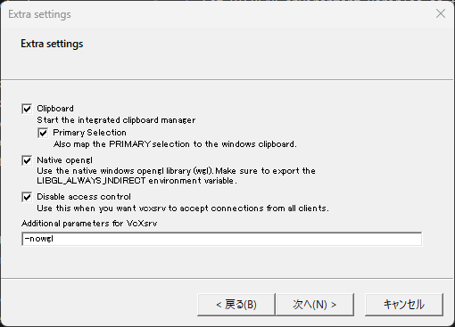

# Memo: Developing and Building a GUI Application on WSL

1. **Install and Launch VcXsrv on Windows**  
   - Download and install [VcXsrv](https://sourceforge.net/projects/vcxsrv/) on your Windows host.  
   - Launch `XLaunch` and configure the server as needed. For testing purposes, you can select **"Disable access control"** to simplify initial setup.



2. **Set the DISPLAY Environment Variable (WSL Side)**  

In your WSL terminal, run the following command to set the `DISPLAY` variable:
```bash
export DISPLAY=$(cat /etc/resolv.conf | grep nameserver | awk '{print $2}'):0
```

This allows GUI applications running in WSL to be displayed via the VcXsrv window on Windows.

3. Build the Executable with PyInstaller

Still in the WSL environment, run:

```bash
pyinstaller --onefile app.py
```
After building, you will find the executable (a Linux binary) in the dist directory (e.g., dist/app).

### Note
If you need a Windows-compatible .exe file, you must run PyInstaller directly on Windows. PyInstaller does not support cross-compilation, so builds created in WSL will not run on Windows without additional steps.